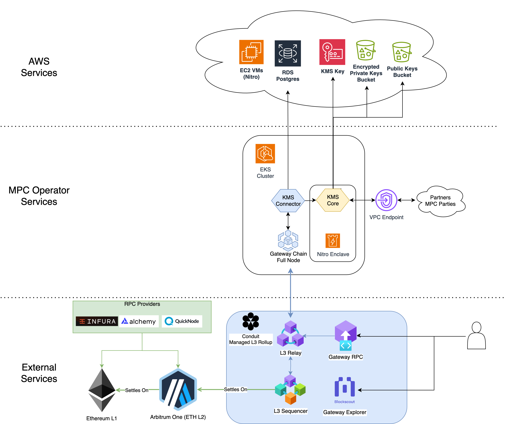
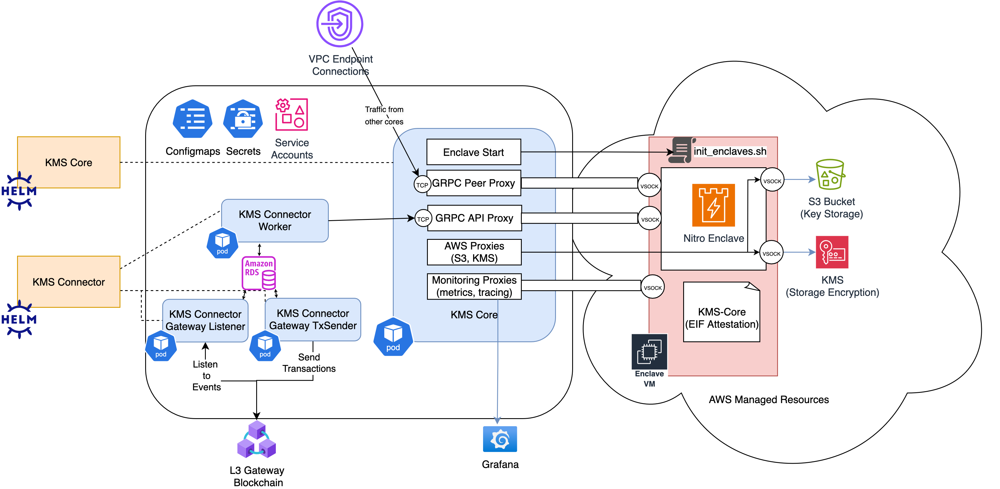

# Zama MPC Operator Kubernetes Deployment

This repo contains the Helm chart configuration to deploy a Zama MPC party on EKS, including:

* KMS-core
* Gateway Arbitrum Full node
* KMS-Connector

## Architecture Diagram

## MPC Operator Services Interactions

## Requirements

AWS Infrastructure following our [Base Requirements](https://zama-ai.slack.com/docs/TFM7VTADR/F09AUAA9MT7):
* EKS cluster following base requirements
* [Zama MPC Cluster Terraform Modules](https://github.com/zama-ai/terraform-mpc-modules)
  * mpc-party
  * vpc-endpoint-provider
  * vpc-endpoint-consumer

A Kubernetes namespace which contains those secrets:

* `registry-credentials`: docker credentials for hub.zama.ai
* `arbitrum`: Arbitrum RPC URL
* `conduit`: Zama Gateway Chain RPC URL
* `connector-database`: database connection details
* `connector-wallet-keys`: private key for the connector gateway wallet

## Install

Install the following tools:
* [Helm](https://helm.sh/)
* [Helmfile](https://github.com/helmfile/helmfile)

To install all Helm charts in either one of those command:

    helmfile apply
    helmfile sync

To select a kubernetes cluster:

    helmfile apply --kube-context "arn:aws:eks:eu-west-1:187242616723:cluster/mpc-partner-testing" -f helmfile.yaml

### Provisioning secrets

##### Registry credentials from hub.zama.ai

    export DOCKER_USERNAME=robot-zama-protocol+***
    export DOCKER_PASSWORD=***
    kubectl create secret docker-registry registry-credentials --docker-server=https://hub.zama.ai --docker-username=$DOCKER_USERNAME--docker-password=$DOCKER_PASSWORD

####  RPC Secrets

    export ARBITRUM_SEPOLIA_RPC_URL=***
    kubectl create secret generic arbitrum --from-literal=arbitrum-sepolia-rpc-url=$ARBITRUM_SEPOLIA_RPC_URL

    export CONDUIT_RPC_HTTP_URL=***
    export CONDUIT_RPC_WS_URL=***
    kubectl create secret generic conduit  \
        --from-literal=conduit-rpc-http-url=$CONDUIT_RPC_HTTP_URL \
        --from-literal=conduit-rpc-ws-url=$CONDUIT_RPC_WS_URL

####  Connector database secret

    export DATABASE_ENDPOINT='***' # To retrieve from Terraform outputs (eg. zama-testnet-kmsconnector.czqqoeo22508.eu-west-1.rds.amazonaws.com:5432)
    export DATABASE_USERNAME='***' # # To retrieve from Terraform outputs (eg. kmsconnector)
    export DATABASE_PASSWORD='***' # To retrieve from AWS Secrets Manager (

    kubectl create secret generic connector-database \
        --from-literal=endpoint=$DATABASE_ENDPOINT \
        --from-literal=username=$DATABASE_USERNAME \
        --from-literal=password=$DATABASE_PASSWORD

#### Connector wallet secret

Generate your ethereum private key using your preferred tool, eg. https://getfoundry.sh/cast/overview

    export WALLET_PRIVATE_KEY=$(cast wallet new --json | jq -r ".[0].private_key")

Create the `kmsconnector-wallet-keys` secret in your cluster, e.g.:

    kubectl create secret generic connector-wallet-keys --from-literal=kms_txsender.private_key=$WALLET_PRIVATE_KEY

### How to check deployment

Run the `mpc-operator-check` Helm chart with:

    helm upgrade --install mpc-operator-check oci://hub.zama.ai/zama-protocol/zama-ai/mpc-operator/charts/mpc-operator-check:0.3.0

---
Steps below are relevant to Key Generation, disregard for now

## Sync public bucket example

    # Step 1: download third parties pub keys (repeat for each party)
    aws s3 sync s3://zama-kms-decentralized-threshold-4-public-dcea8392 --region eu-west-3 .
    # aws s3 sync --no-sign-request  --region eu-west-1 s3://zama-zws-testnet-tkms-jpn6x .
    # Step 2: upload third parties pub keys to your party public bucket
    aws s3 sync . s3://zama-zws-dev-tkms-decentralized-l6jwj

    aws s3 sync s3://zama-zws-dev-tkms-decentralized-l6jwj . --region eu-west-1
    aws s3 sync . s3://zama-kms-decentralized-threshold-4-public-dcea8392

## KMS Init

Shell into kms-core pod

    kubectl exec -it kms-core-1 -- sh

    cd /app/kms/core/service/
    bin/kms-init --addresses http://kms-core:50100

## KMS Core Client

Shell into kms-core-client pod:

    kubectl exec -it kms-client-0 -- bash
